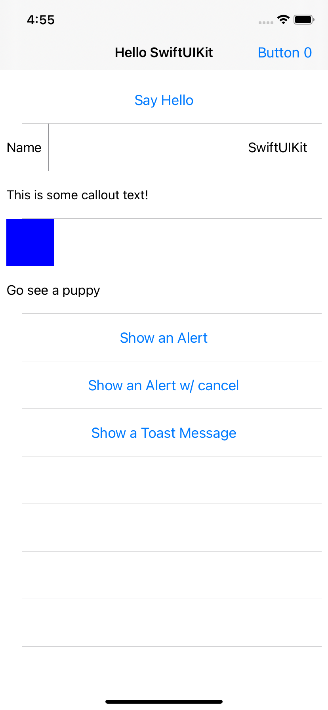

# SwiftUIKit

UIKit version of SwiftUI

## Example Code
```Swift
import UIKit
import SwiftUIKit

class ViewController: UIViewController {
    
    override func viewDidLoad() {
        super.viewDidLoad()
        
        Navigate.shared.configure(controller: navigationController)
            .set(title: "Hello SwiftUIKit")
            .setRight(barButton: BarButton {
                Button({
                    print("Tapped the barbutton")
                }) {
                    Label("Button 0")
                }
            })
        
        
        view.embed {
            SafeAreaView {
                Table(defaultCellHeight: 60) {
                    [
                        Button("Say Hello") {
                            print("Hello World!")
                        },
                        
                        HStack(withSpacing: 8) {
                            [
                                Label("Name"),
                                
                                Divider(.vertical),
                                
                                Spacer(),
                                
                                Field(value: "SwiftUIKit",
                                      placeholder: "Some Name",
                                      keyboardType: .default)
                                    .inputHandler { print("New Name: \($0)") }
                            ]
                        },
                        
                        Label.callout("This is some callout text!"),
                        
                        ZStack {
                            [
                                Image(.blue)
                                    .frame(height: 60, width: 60)
                                    .offset(x: 100)
                            ]
                        },
                        
                        NavButton(destination: UIViewController {
                            View(backgroundColor: .white) {
                                LoadingImage(URL(string: "https://cdn11.bigcommerce.com/s-oe2q4reh/images/stencil/2048x2048/products/832/1401/Beige_Pekingese_Puppy__21677.1568609759.jpg")!)
                                    .contentMode(.scaleAspectFit)
                            }
                        }, style: .push) {
                            Label("Go see a puppy")
                        },
                        
                        Button("Show an Alert") {
                            Navigate.shared.alert(title: "Hello this is an Alert!",
                                                  message: "Just a test...",
                                                  secondsToPersist: 3)
                        },
                        
                        Button("Show an Alert w/ cancel") {
                            Navigate.shared.alert(title: "Hello World",
                                                  message: "This is an alert",
                                                  withActions: [.cancel],
                                                  secondsToPersist: 3)
                        },
                        
                        Button("Show a Toast Message") {
                            Navigate.shared.toast(style: .error, pinToTop: true, secondsToPersist: 4) {
                                Label("This is a test error message!")
                            }
                        }
                    ]
                }
            }
        }
    }
}
```

## Example View



****

# oneleif Project


### Project Info

This project is a oneleif active project.

[](https://twitter.com/oneleifdev)

[](https://www.youtube.com/channel/UC3HN0jID38K0Vb_WChvgQmA)

## How to join oneleif
Click on the link below to join the Discord server.

You will start with limited permissions, in a text channel that only moderators will see.

To get full access: read the rules, make an introduction in #introductions, and add an appropriate username.

When you're done with the above, shoot a message to the #start channel to let us know, and we will give you full access.

[](https://discord.gg/tv9UdJK)

### Questions?
Feel free to email us at: oneleifdev@gmail.com 
